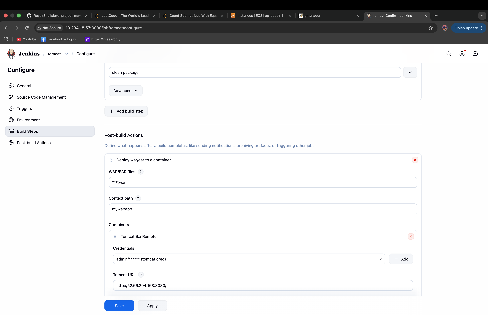
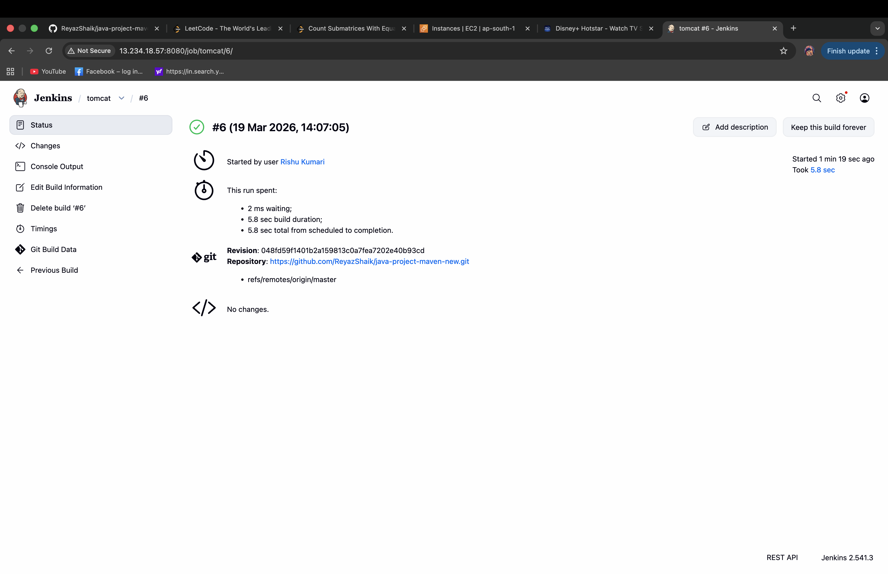
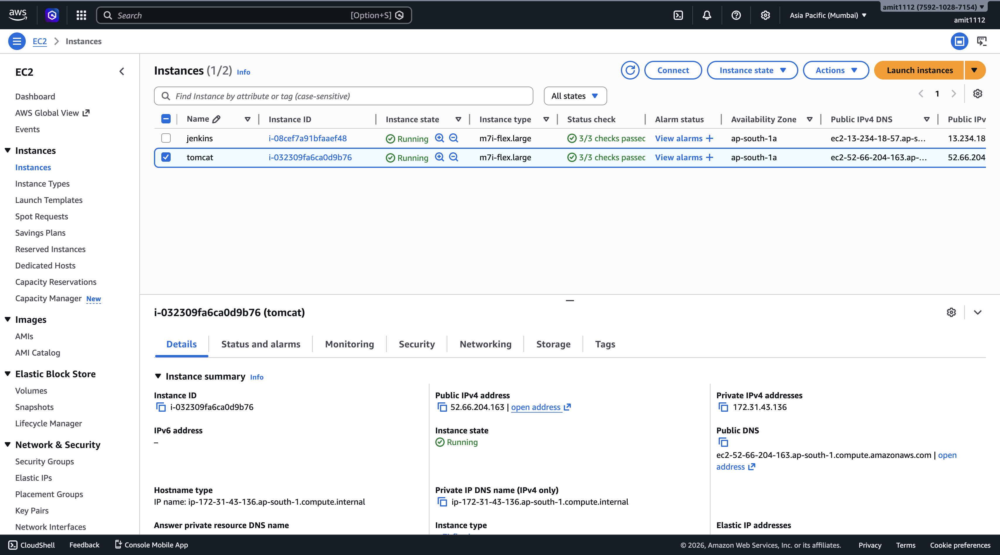
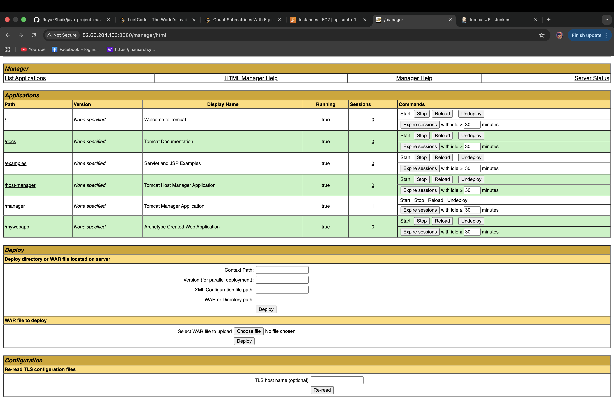

# 🚀 End-to-End CI/CD Pipeline using Jenkins Freestyle Job, Maven & AWS EC2

---

## 📌 Project Overview

This project demonstrates the implementation of a CI/CD (Continuous Integration and Continuous Deployment) workflow for a Java-based web application using Jenkins Freestyle Job.

The workflow automates the process of fetching source code from GitHub, building the application using Maven, and deploying it to an Apache Tomcat server hosted on AWS EC2.

It focuses on understanding the core concepts of CI/CD, including automation, remote deployment, and server-to-server communication using SSH.

---

## 🎯 Objectives

* Automate build and deployment process
* Reduce manual intervention in software delivery
* Implement real-world DevOps practices
* Deploy application on cloud infrastructure

---

## 🏗️ System Architecture

GitHub Repository → Jenkins Server (EC2) → Maven Build → Deploy via SSH → Tomcat Server (EC2)

---

## ⚙️ Tech Stack

| Category        | Tools Used              |
| --------------- | ----------------------- |
| Language        | Java                    |
| Build Tool      | Maven                   |
| CI/CD           | Jenkins (Freestyle Job) |
| Cloud           | AWS EC2                 |
| Server          | Apache Tomcat           |
| Version Control | Git & GitHub            |
| Communication   | SSH                     |

---

## 🔄 CI/CD Workflow

1. Developer pushes code to GitHub
2. Jenkins pulls latest code from repository
3. Maven builds the project (`clean install`)
4. WAR file is generated
5. Jenkins connects to Tomcat server via SSH
6. Application is deployed to Tomcat
7. Application becomes accessible via browser

---
## ⚙️ CI/CD Implementation Details

This project uses Jenkins Freestyle Job to implement the CI/CD pipeline.

Although Jenkins Pipeline (Jenkinsfile) is more advanced, this project focuses on understanding the core CI/CD workflow using Freestyle configuration.

---
## 📸 Project Screenshots

### 🔹 Jenkins Job Configuration

### 🔹 Build Success Output

### 🔹 EC2 Instances Running

### 🔹 EC2 Instances Logging

### 🔹 Application Deployed on Tomcat

### 🔹 Application Deployed 

---

## 🧠 Key Learnings

* Hands-on experience with CI/CD pipeline
* Jenkins job configuration and automation
* AWS EC2 setup and management
* Secure SSH-based deployment
* Maven build lifecycle understanding

---

## ⚠️ Challenges Faced

* SSH connection setup between servers
* Managing `.pem` key permissions
* Debugging Jenkins build failures
* Configuring remote deployment

---

## 🔐 Security Considerations

* Private keys (.pem) are not exposed
* Credentials are managed securely
* SSH authentication is used for deployment

---

## 📦 Source Code Reference

The base project used in this implementation is taken from:

👉 https://github.com/ReyazShaik/java-project-maven-new.git

This repository was used for learning and deployment purposes, while the CI/CD pipeline setup and AWS deployment were implemented independently.

---

## 🚀 Future Enhancements

* Convert Freestyle Job to Jenkins Pipeline (Jenkinsfile)
* Integrate GitHub Webhooks (Auto Trigger Build)
* Dockerize the application
* Implement Kubernetes deployment
* Add monitoring tools (Prometheus, Grafana)

---

## 💼 Resume Highlights

* Designed and implemented CI/CD pipeline using Jenkins
* Automated deployment of Java application on AWS EC2
* Integrated Maven for build automation
* Configured secure SSH-based communication between servers

---

## 👩‍💻 Author

**Risu Kumari**
B.Tech CSE | DevOps Enthusiast

📧 Email: [rs139323@gmail.com](mailto:rs139323@gmail.com)
🔗 GitHub: https://github.com/rishu-1112

---
